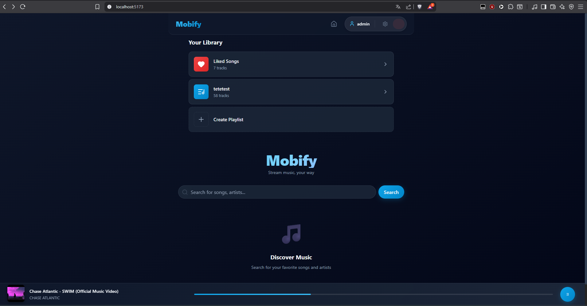
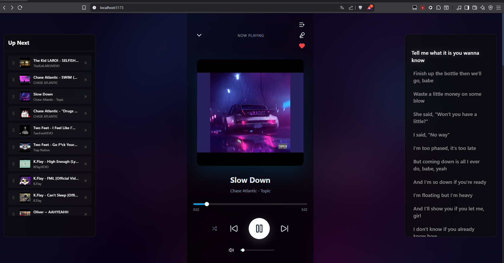
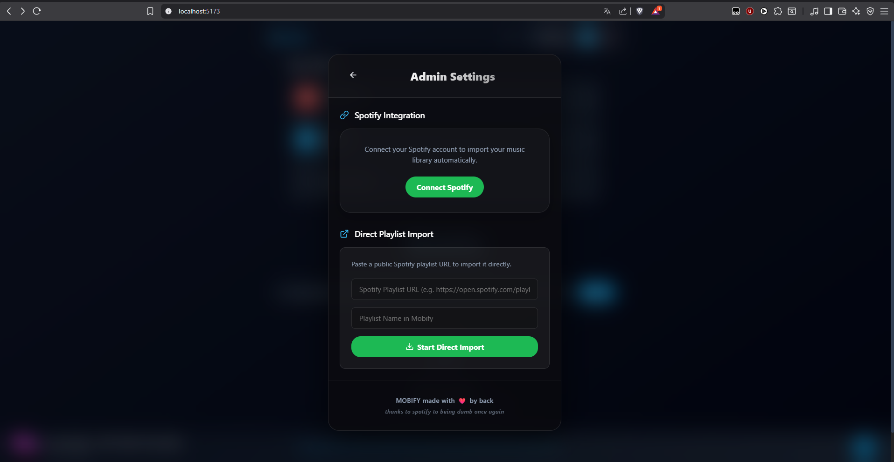

# Mobify 🎵

**The Ultimate Self-Hosted Music Streaming Platform.**

Mobify is a modern, open-source **Spotify Clone** that lets you stream high-quality audio directly from **YouTube** without ads. It features a premium, responsive interface, real-time lyrics synchronization, and seamless playlist management. Host your own music server and take control of your library.



## ✨ Features

*   🎧 **Ad-Free Streaming**: Plays the highest quality audio directly from YouTube.
*   📜 **Real-Time Lyrics**: Enjoy perfectly synced lyrics (LRC) that scroll with the music.
*   🟢 **Spotify Import**: Transfer your **Playlists** and **Liked Songs** from Spotify in one click.
*   📂 **Library Management**: Create custom playlists, favorite tracks, and organize your music.
*   📱 **Mobile First**: Fully responsive design that looks and feels like a native app on iOS and Android.
*   🎨 **Beautiful UI**: Sleek dark mode with glassmorphism effects and smooth animations.
*   🎚️ **Advanced Player**: Shuffle, Queue management, Volume control, and Keyboard shortcuts.

## 📸 Screenshots

| Player View | Spotify Import |
|:---:|:---:|
|  |  |

---

## 🚀 Installation Guide

### 1. Prerequisites
Before starting, ensure you have the following installed:
*   **Node.js** (v18 or higher)
*   **Python** (v3.10 or higher)
*   **FFmpeg** (Must be added to your system PATH)

### 💻 Windows Installation (Local PC)

#### Backend (Server)
1.  Open a terminal in the `server` folder.
2.  Create a virtual environment:
    ```bash
    python -m venv venv
    ```
3.  Activate the environment:
    ```bash
    .\venv\Scripts\activate
    ```
4.  Install dependencies:
    ```bash
    pip install -r requirements.txt
    ```
5.  **Important**: Download `ffmpeg.exe` and place it in the `server` folder OR install it system-wide and add to PATH.
6.  Start the server:
    ```bash
    python main.py
    ```
    *Server runs on `http://localhost:8000`*

#### Frontend (Client)
1.  Open a new terminal in the `client` folder.
2.  Install dependencies:
    ```bash
    npm install
    ```
3.  Start the development server:
    ```bash
    npm run dev -- --host
    ```
4.  Open your browser at `http://localhost:5173`.

---

## ⚙️ Configuration
The server configuration relies on `config.json` in the root (or server) directory.

---

## 📱 iOS App Build (IPA)
You can build a native iOS Webview App for Mobify directly using GitHub Actions. No Mac required!

### How to Build:
1.  **Fork/Push**: Ensure this project is in your GitHub repository.
2.  **Actions**: Go to the **Actions** tab on your GitHub repository.
3.  **Select Workflow**: Click on the **"Build iOS IPA"** workflow on the left.
4.  **Run**: Click the **Run workflow** button (ensure the branch is `main`).
5.  **Download**: Once finished (approx 2-3 mins), navigate to the **Releases** section on the right side of your repository home page.
6.  **Install**: Download the `Mobify.ipa` and install it on your iPhone using **SideStore** or **AltStore**.

> [!TIP]
> Each build will be automatically numbered and tagged (e.g., `ios-v1`, `ios-v2`) for easy tracking.
